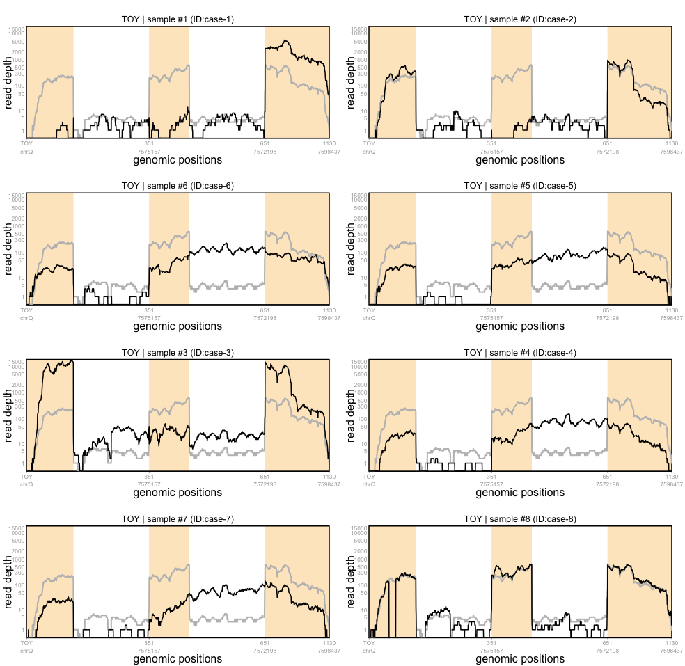

A toy dataset is available in the `SCISSOR` package:

```r
library(SCISSOR)
data(TOY_data)
```

This dataset contains base-level coverage of a hypothetical gene *TOY* including three exons and the whole intronic regions between the exons. Among n=260 cases, there are eight samples with strong shape changes. Here, we aim to identify these eight shape changes using `SCISSOR`. 

## Data preparation

We first obtain pileup data matrix using `build_pileup` and genomic ranges using `get_Ranges` that will be used as inputs for the function `Scissor`: 

```r
Gene = toygene_symbol
regions = toygene_regions
pileupData = build_pileup(Pileup=toygene_coverage,regions=regions,
                          inputType="whole_intron",outputType="part_intron")
geneRanges = get_Ranges(Gene="TOY",regions=regions,outputType="part_intron")
caseIDs = colnames(pileupData)
```

In practice, you will often obtain pileup data directly from BAM files. This can be done with `read_BAM` (see [Tutorial](tutorial.md#get-coverage-from-bam-files)). If you do not specify sample IDs, the `build_pileup` and `read_BAM` will generate the IDs by default as follows:

```r
> head(caseIDs)
[1] "case-1" "case-2" "case-3" "case-4" "case-5" "case-6"
```

## Statistical analysis

The whole procedures of SCISSOR can be performed by using all-in-one function `Scissor` (see [Tutorial](tutorial.md#run-scissor)). 

```r
ScissorOutput=Scissor(pileupData=pileupData,Ranges=geneRanges)
```

The object **ScissorOutput** is a large list containing the results. The identified shape changes are saved in `ScissorOutput$SC` and the resulting outlyingness scores from each of the global and local procedures are saved in `ScissorOutput$GSC$OS` and `ScissorOutput$LSC$OS`, respectively. You can plot the outlyingness scores using `plot_ScissorOS`:

```r
par(mfrow=c(1,2))
plot_ScissorOS(object=ScissorOutput,colmat=NULL,textSC=TRUE)
```


The figures show the indices of outlier samples with the kernel desntify estimates from the scores. 


You can also visualize the identified shape changes using `plot_pileup`:

```r
par(mfrow=c(4,2),mar=c(2,2,2,2))
for (case in ScissorOutput$SC) {
  plot_pileup(Pileup=ScissorOutput$logData,Ranges=geneRanges,cases=case,
              logcount=ScissorOutput$logshiftVal)
}
```



The first seven outliers are associated with exon skipping or intron retention whereas the last outlier is showing small deletion in the middle of the first exon. 


